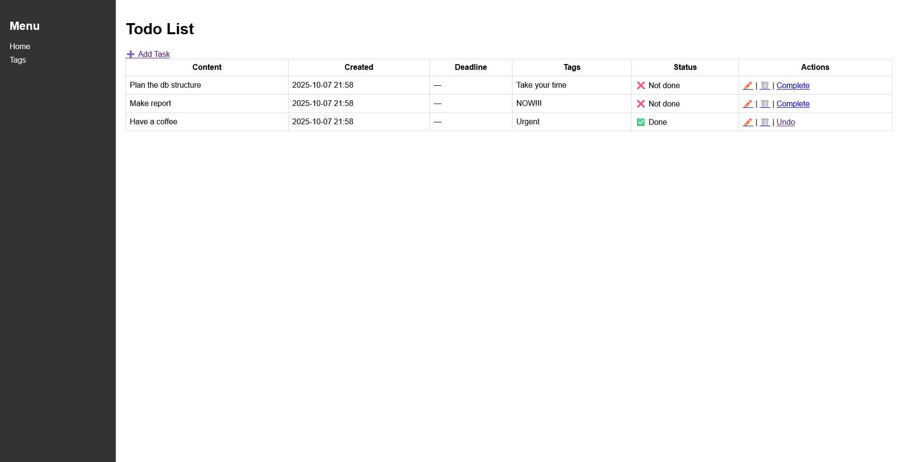
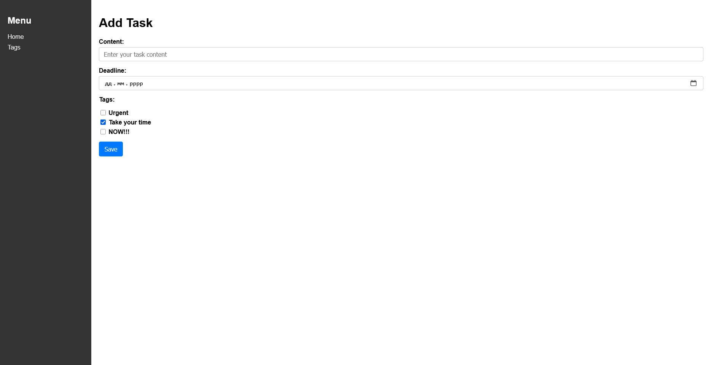
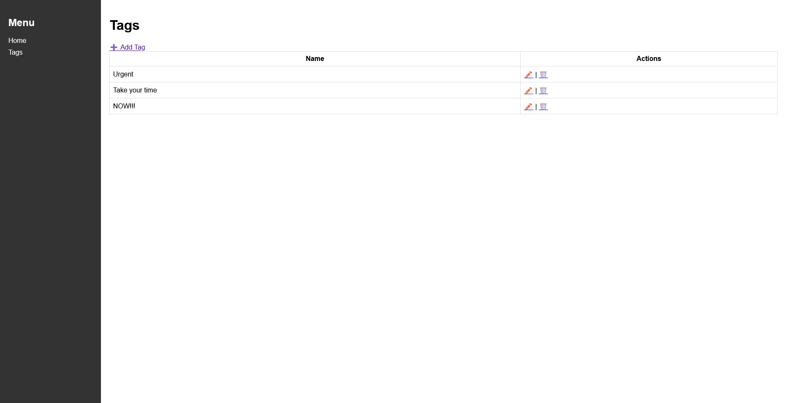
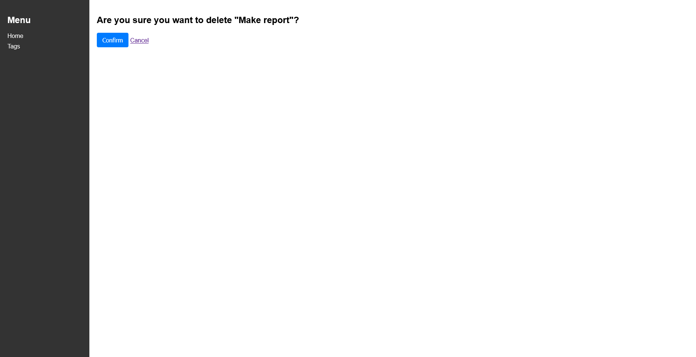

# Todo List Application

A Django-based task management application that allows users to create, edit, and organize tasks with tags. The application features a clean interface with sidebar navigation, task status tracking, and flexible tagging system for categorizing tasks.

## Features

- Create, edit, and delete tasks
- Set optional deadlines for tasks
- Mark tasks as complete/incomplete
- Organize tasks with multiple tags
- Manage tags (create, edit, delete)
- Automatic task ordering (incomplete first, newest first)
- Responsive sidebar navigation
- Confirmation dialogs for deletions
- Clean and intuitive user interface

## Technologies

- Python 3.x
- Django 5.2.7
- SQLite (default database)
- HTML/CSS
- Bootstrap-styled forms

## Implementation

### Models

#### Task Model
- Stores task content, creation timestamp, optional deadline, and completion status
- Uses many-to-many relationship with Tag model for flexible categorization
- Custom ordering: incomplete tasks appear first, followed by newest tasks

**Fields:**
- `content` - Task description (CharField, max 255 characters)
- `created_at` - Automatic creation timestamp (DateTimeField)
- `deadline` - Optional deadline (DateTimeField, nullable)
- `is_done` - Completion status (BooleanField, default: False)
- `tags` - Many-to-many relationship with Tag model

#### Tag Model
- Simple model with unique tag names
- Allows tasks to be grouped by themes (e.g., Work, Home, Urgent)
- Reusable across multiple tasks

**Fields:**
- `name` - Unique tag name (CharField, max 50 characters)

### Forms

#### TaskForm
- ModelForm with custom widgets for better UX
- HTML5 date picker for deadline selection
- Checkbox list for tag assignment
- Bootstrap styling for consistent appearance

#### TagForm
- Simple form for creating/editing tag names
- Input validation ensures unique tag names
- Bootstrap form controls for styling

### Views

All views implemented using Django's class-based views:

#### Task Views
- `TaskListView` - displays all tasks in a table with ordering
- `TaskCreateView` / `TaskUpdateView` - form-based task creation and editing
- `TaskDeleteView` - confirmation-based deletion
- `ToggleTaskStatusView` - custom view for quick status changes

#### Tag Views
- `TagListView` - displays all tags with management options
- `TagCreateView` / `TagUpdateView` - tag creation and editing
- `TagDeleteView` - confirmation-based tag deletion

All views use `reverse_lazy` for URL resolution and follow Django conventions for success redirects.

## Screenshots

### Task List Page

*Main page displaying all tasks with content, creation date, deadline, tags, status, and action buttons*

### Task Form

*Form for creating and editing tasks with date picker and tag selection*

### Tag List Page

*Tag management interface with add, edit, and delete options*

### Delete Confirmation

*Confirmation dialog before deleting tasks or tags*

## Installation

### Prerequisites

- Python 3.x
- pip package manager

### Setup Instructions

1. Clone the repository
```bash
  git clone https://github.com/turulko-oleksandr/todo-app.git
  cd todo_app
```

2. Create and activate virtual environment
```bash
  python -m venv venv

# On Linux/Mac:
source venv/bin/activate

# On Windows:
venv\Scripts\activate
```

3. Install dependencies
```bash
  pip install -r requirements.txt
```

4. Run database migrations
```bash
  python manage.py migrate
```

5. (Optional) Create superuser for admin access
```bash
  python manage.py createsuperuser
```

6. Start development server
```bash
  python manage.py runserver
```

7. Open your browser and navigate to
```
http://127.0.0.1:8000/
```

## Usage

### Managing Tasks

**Create a Task:**
1. Click "➕ Add Task" button on the home page
2. Enter task content
3. Optionally set a deadline using the date picker
4. Select relevant tags from the checkbox list
5. Click "Save"

**Edit a Task:**
1. Click the edit icon (✏️) next to any task
2. Modify the fields as needed
3. Click "Save"

**Delete a Task:**
1. Click the delete icon (🗑️) next to the task
2. Confirm the deletion

**Toggle Task Status:**
1. Click "Complete" to mark a task as done
2. Click "Undo" to revert a completed task to incomplete

### Managing Tags

**Create a Tag:**
1. Navigate to "Tags" page from the sidebar
2. Click "➕ Add Tag" button
3. Enter a unique tag name
4. Click "Save"

**Edit a Tag:**
1. Click the edit icon (✏️) next to the tag
2. Update the tag name
3. Click "Save"

**Delete a Tag:**
1. Click the delete icon (🗑️) next to the tag
2. Confirm the deletion

## Project Structure

```
todo_app/
├── tasks/                      # Main application
│   ├── migrations/             # Database migrations
│   │   └── 0001_initial.py
│   ├── templates/              # Task and tag templates
│   │   ├── task_list.html
│   │   ├── task_form.html
│   │   ├── task_confirm_delete.html
│   │   ├── tag_list.html
│   │   ├── tag_form.html
│   │   └── tag_confirm_delete.html
│   ├── admin.py               # Admin configuration
│   ├── forms.py               # TaskForm and TagForm
│   ├── models.py              # Task and Tag models
│   ├── urls.py                # URL routing
│   └── views.py               # Class-based views
├── templates/
│   └── base.html              # Base template with sidebar
├── todo_app/                   # Project settings
│   ├── settings.py
│   └── urls.py
├── .gitignore
├── manage.py
└── requirements.txt
```

## URL Structure

| URL | View | Description |
|-----|------|-------------|
| `/` | TaskListView | Home page - task list |
| `/task/add/` | TaskCreateView | Create new task |
| `/task/<id>/edit/` | TaskUpdateView | Edit task |
| `/task/<id>/delete/` | TaskDeleteView | Delete task |
| `/task/<id>/toggle/` | ToggleTaskStatusView | Toggle task status |
| `/tags/` | TagListView | Tag list |
| `/tags/add/` | TagCreateView | Create new tag |
| `/tags/<id>/edit/` | TagUpdateView | Edit tag |
| `/tags/<id>/delete/` | TagDeleteView | Delete tag |
| `/admin/` | Django Admin | Admin interface |

## Development

### Admin Interface

Access Django admin at `http://127.0.0.1:8000/admin/` to manage tasks and tags through the administrative interface.
